# Routey - AI Travel Planner

Routey (SmartTravelApp), seyahat planlamayı akıllı, kişiselleştirilmiş ve sosyal bir deneyime dönüştüren, **SwiftUI** ile geliştirilmekte olan yeni nesil bir iOS seyahat uygulamasıdır. İçerisinde barındırdığı yapay zeka (Gemini & CoreML) destekli rota oluşturucu, kişiliğe göre destinasyon önerileri ve "Sosyal Eşleşme" modülü ile gezginlere seyahat arkadaşı bulma imkanı sunar.

## Özellikler

*   **Yapay Zeka Destekli Rota Planlama:** Gemini AI entegrasyonu sayesinde kullanıcıların bütçe, süre ve ilgi alanlarına göre özel, gün gün planlanmış seyahat rotaları oluşturur.
*   **CoreML ile Akıllı Destinasyon Önerileri:** Kullanıcı alışkanlıklarını analiz eden makine öğrenmesi modeliyle, bir sonraki seyahatiniz için en uygun yerleri keşfetmenizi sağlar.
*   **Solo Gezginler İçin Sosyal Eşleşme:** Yalnız seyahat edenleri ortak lokasyon, bütçe ve davranışsal tercihlere göre eşleştiren özel sosyal modül.
*   **İnteraktif Harita & Rota Görselleştirme:** MapKit kullanılarak seyahat rotalarının harita üzerinde (polyline) dinamik olarak çizilmesi ve görselleştirilmesi.
*   **Tinder Benzeri Onboarding (Swipe):** Kullanıcıların seyahat tercihlerini ve kişilik profillerini eğlenceli bir kart kaydırma arayüzüyle belirlemesi.
*   **İzole Veri Yönetimi:** Her kullanıcı için kaydedilen seyahatlerin, favori mekanların ve profil bilgilerinin güvenli ve izole bir şekilde saklanması.
*   **Premium UI/UX:** SwiftUI kullanılarak geliştirilen modern, akıcı ve tamamen native kullanıcı deneyimi.

## Mimari & Teknolojiler

*   **Dil & Framework:** Swift, SwiftUI
*   **Mimari Yaklaşım:** MVVM (Model-View-ViewModel)
*   **Yapay Zeka:** Google Gemini AI API, CoreML
*   **Harita & Konum:** MapKit, CoreLocation

## Kurulum

1.  Depoyu bilgisayarınıza klonlayın:
    ```bash
    git clone https://github.com/kullanici_adiniz/SmartTravelApp.git
    cd SmartTravelApp
    ```

2.  Projeyi Xcode ile açın:
    ```bash
    open SmartTravelApp.xcodeproj
    ```

3.  Gerekli API Anahtarlarını Ayarlayın:
    *   Uygulamanın yapay zeka özelliklerini kullanabilmesi için geçerli bir **Gemini API Anahtarına** ihtiyacınız vardır.
    *   İlgili API anahtarını proje içerisindeki servis konfigürasyon dosyalarına eklediğinizden emin olun.

4.  Uygun bir simülatör (örneğin: iPhone 15 Pro) veya fiziksel bir cihaz seçerek projeyi derleyin ve çalıştırın (`Cmd + R`).

## Proje Yapısı

*   `App/`: Uygulama başlangıç noktası, ana konfigürasyonlar ve asset'ler.
*   `Models/`: Veri modelleri, JSON yapıları ve API yanıt modelleri.
*   `Views/`: SwiftUI ekranları (Discover, Planner, Trips, Profile, Social vb.).
*   `ViewModels/`: İş mantığı (Business logic) ve görünüm modelleri.
*   `Services/`: Dış servis bağlantıları (API yöneticileri, AI entegrasyonları, CoreML bağdaştırıcıları).
*   `Core/`: Uygulamanın temel yöneticileri (Storage, Route, vs.).

## Ekran Görüntüleri

| Kişilik Testi (Swipe) | Swipe Sonucu | Keşfet |
|:---:|:---:|:---:|
| 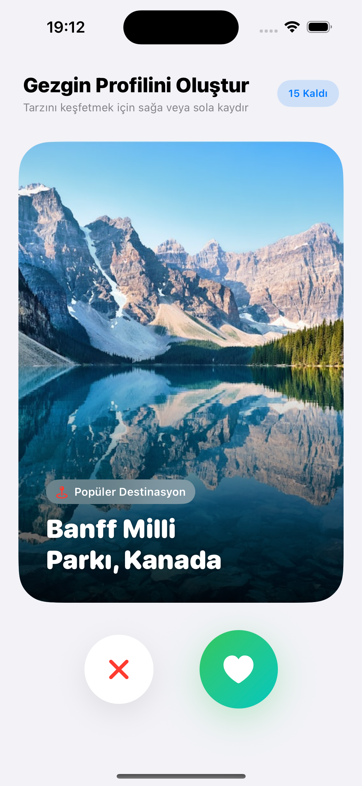 | 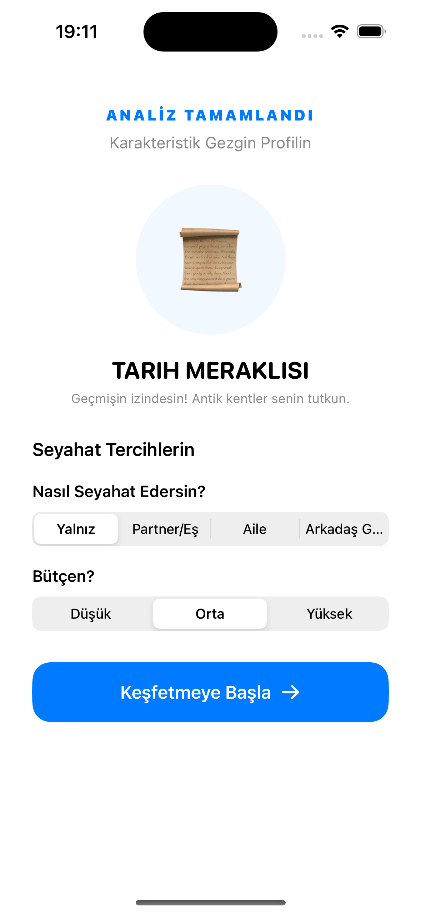 | 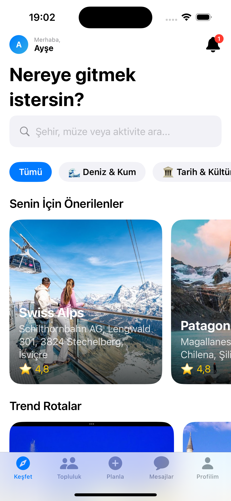 |

| Plan Oluşturma | Plan Oluşturma Detay | Plan Hazırlanıyor |
|:---:|:---:|:---:|
| 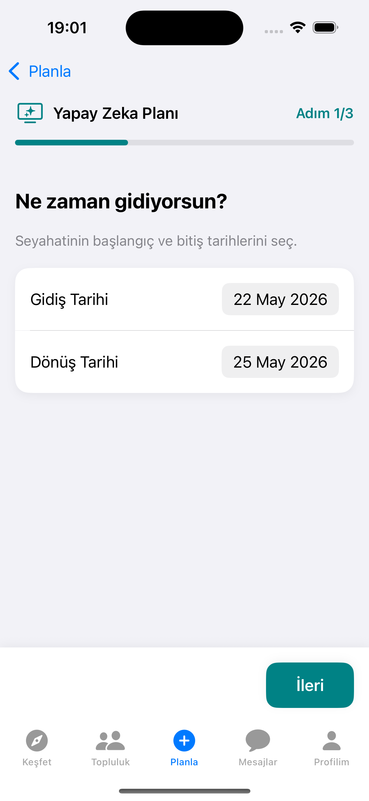 | 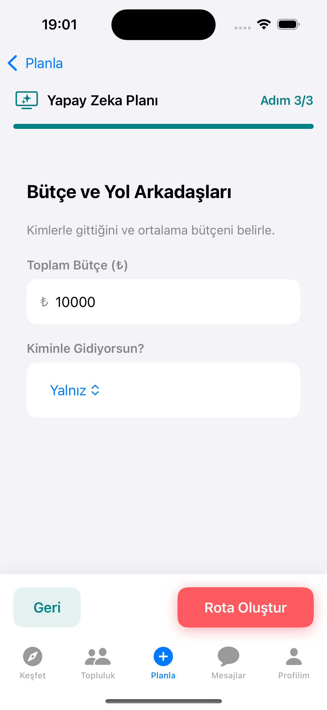 | 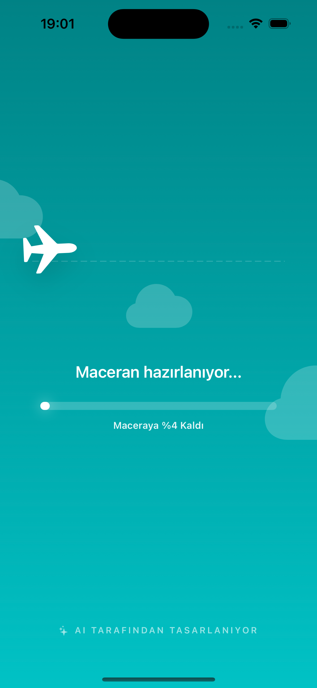 |

| Plan Önizleme | Plan Özeti 1 | Plan Özeti 2 |
|:---:|:---:|:---:|
| 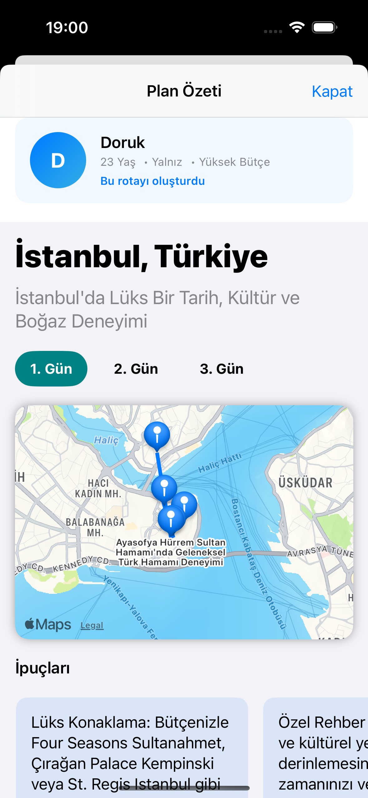 | 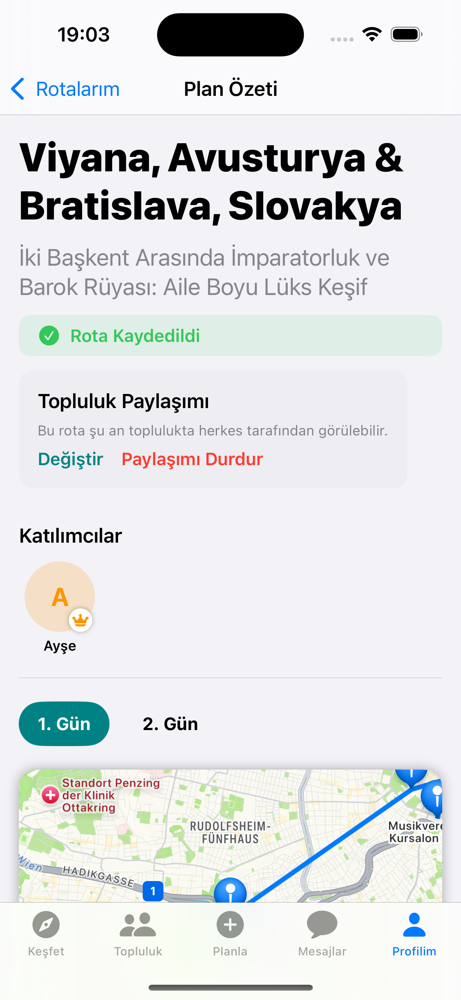 | 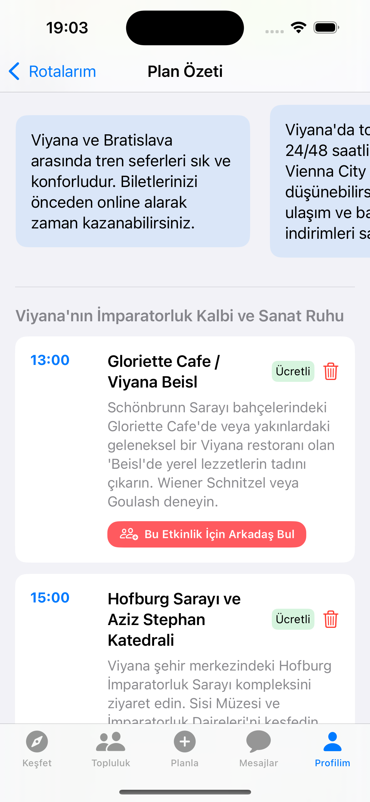 |

| Paylaşılan Rotalar | Paylaşılan Etkinlikler | Uyum Analizi |
|:---:|:---:|:---:|
| 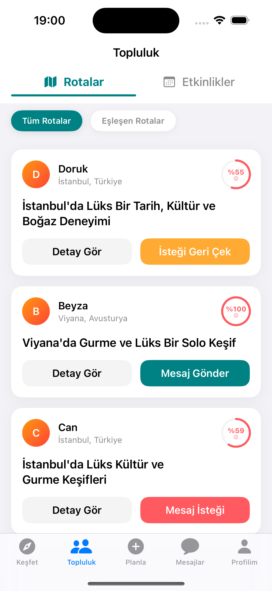 | 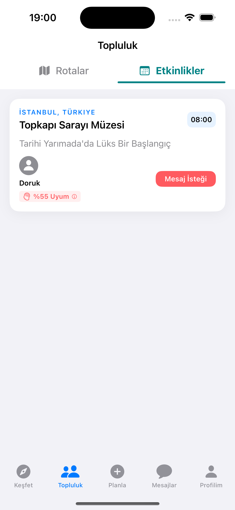 | 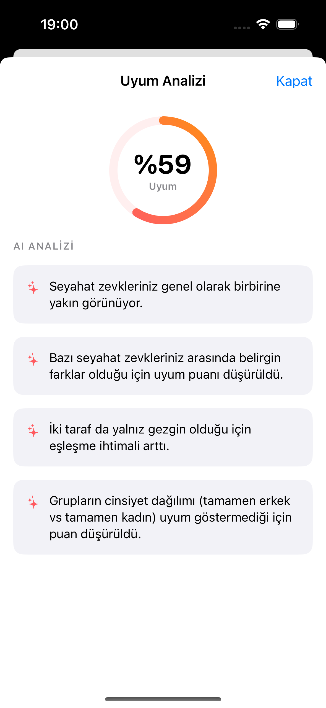 |

| Mesajlar | Mesaj Sohbeti | Bildirimler |
|:---:|:---:|:---:|
| 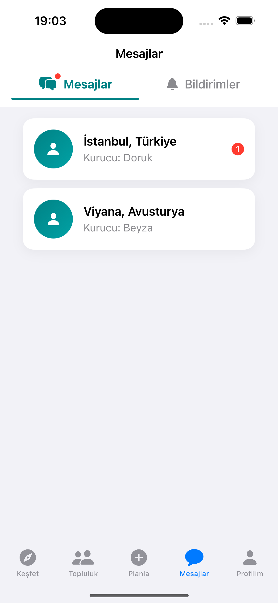 | 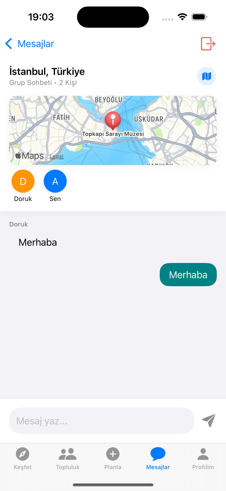 | 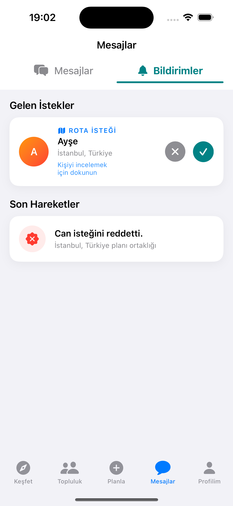 |

| Profil |
|:---:|
| 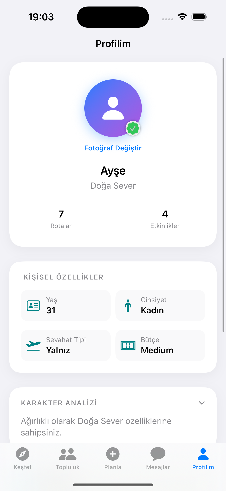 |
